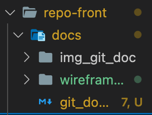
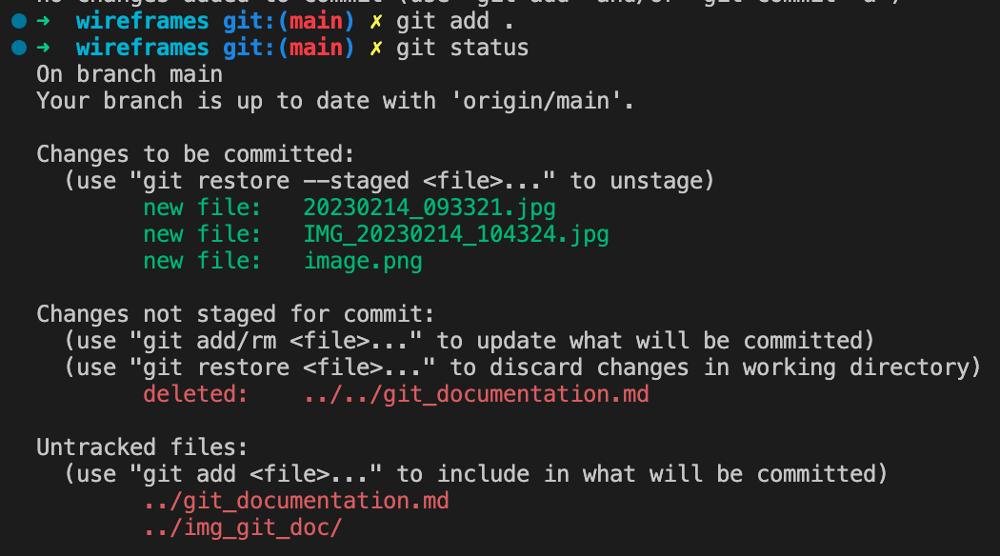
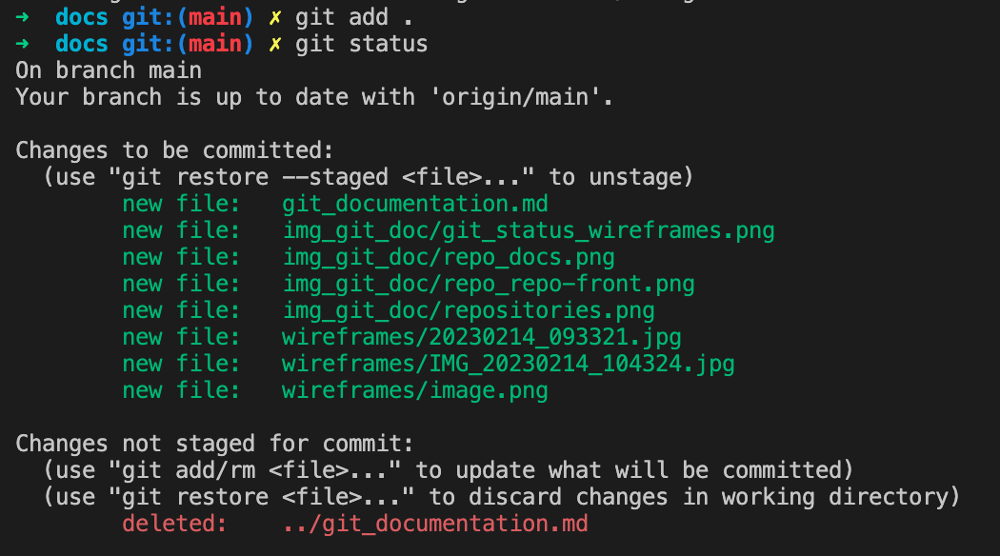
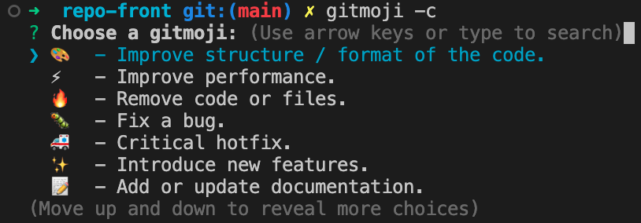
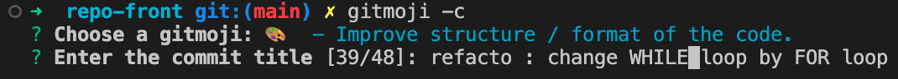
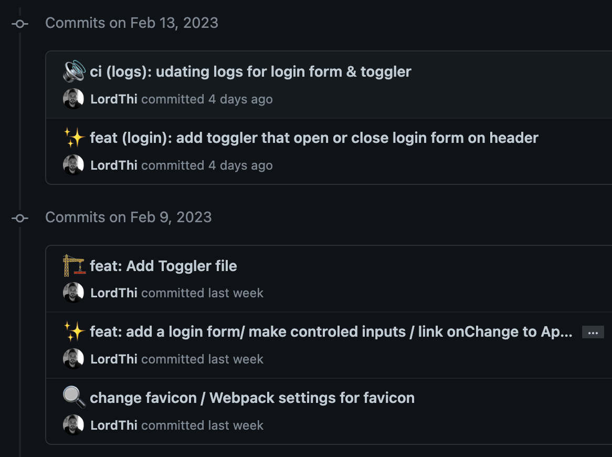
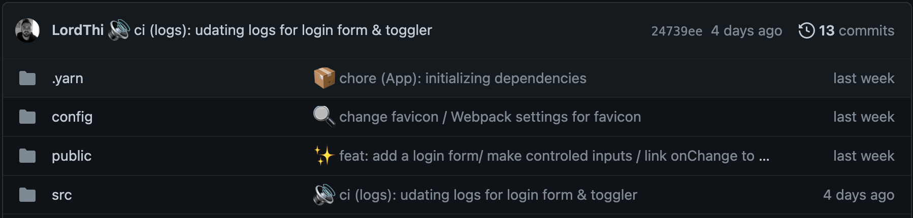
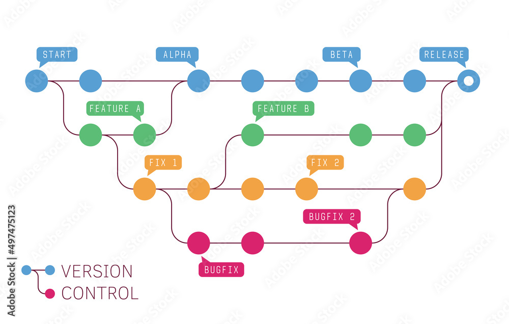
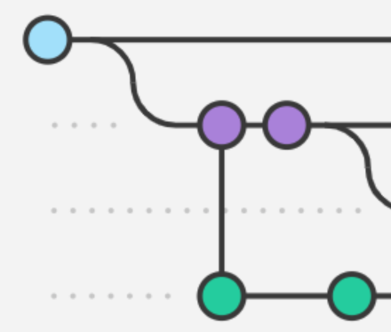

# Guide Git

Git est un système de gestion de code permettant le versionning de nos fichiers et donc de notre projet.

En français?

Imaginons que nous voulons créer une nouvelle voiture, la Allint Car permettant de ne plus jamais être allergiques
aux bouchons et autres mauvais conducteurs. Cette voiture devra être parfaite pour nos clients, on ne peut pas se
permettre de leur vendre une caisse à savon, puis une caisse à savon avec un moteur, etc, etc jusqu'à arriver 30 ans
plus tard avec une voiture volante et leur dire "Voila, c'est cette voiture là qu'on avait en tête au départ".
Pour livrer un produit fini, il va falloir prototyper.

Mais du coup Jamy, quand est ce que je sais quand mon prototype est terminé et qu'il faut en attaquer un autre?

Et bien je vais te répondre Fred. Pour un objet physique tel que notre voiture, nous pouvons nous dire que l'on
va créer un nouveau prototype à chaque nouvelle fonctionnalité ou évolution cosmétique de la voiture.
Nous aurons donc: AllintCar V1, AllintCar V2, AllintCar V3, AllintCar Vfinale, AllintCar Vfinale2, etc....
Ce qu'on a fait ici, c'est du versionning.

Ça sera super pour remplir notre futur musée automobile quand on sera super riche, mais ça peut vite devenir assez
encombrant, surtout si on décide de faire deux protos avec la forme des phares pour seul changement.

Nous avons l'avantage de travailler dans un environnement virtuel. Mais on est pas des Webdesigners (balle perdue),
On ne va pas creer indexV1.js, indexV2.js + styles.css, indexV1finalementParcequeCetaitMieux.js + stylesV2.css, etc....

Nous avons GIT.

Git va nous permettre d'avoir ces fameuses versions fixées à un moment donné de notre projet, tout en continuant
de pouvoir travailler dessus. L'avantage? Si demain nous décidons de mettre notre scan en place et que cette fonctionnalité
casse l'outil recherche ou la fonctionnalité Connexion, nous pouvons revenir à la version d'avant le scan en allant
directement sur le commit juste avant l'implementation de cette fonctionnalité et repartir de cette base.

Faire souvent des commits en indiquant ce que l'on a mis dedans est donc promordial pour pouvoir faire cela,
encore plus en travail d'équipe où chacun peut casser le code de l'autre sans le vouloir.

Il est donc important d'avoir une convention entre nous pour éviter de nous perdre.

# Commandes git utiles

Pour pouvoir utiliser git, il faut suivre un certain chemin. Imaginons que nous souhaitons envoyer notre belle tarte aux pommes 🥧 à MèreGrand.js pour éviter de se faire croquer par le Loup.CSS . Quelles pourraient être les étapes clés ?

- Prendre une belle boite et mettre notre tarte dedans,
- Écrire notre plus beau message à Mamie et l'accrocher sur la boite que l'on ferme bien comme il faut,
- Envoyer le colis.

Ces trois étapes correspondent au chemin empreinté par nos fichier pendant le `add`, `commit` et `push`.

Les commandes suivantes auront un résultat différent en fonction de l'endroit où vous les écrirez (le dossier courant).

<details>
<summary>Explication de la notion de dossier courant</summary>
<br>

Soit l'arborescence suivante:  
  

Si je vois dans ma console:  
  
Le **dossier courant** est `repo-front`.

Si je vois dans ma console:  
  
Le **dossier courant** est `repo-front/docs`.
</details>

## Pendant le projet -MODE SOLO 🧍-

<details>
<summary>📺 git status</summary>
<br>
Cette commande doit être la commande reflexe. Elle permet de connaitre l'état de votre projet vis à vis de git.  
Savoir dans quel état est notre git est très utile. Avec la commande suivante (`git add`), vous verrez que l'on peut ajouter un ou
plusieurs dossiers. Savoir quel fichier ou dossier est en cours de "sauvegarde", quel dossier est suvi, quel dossier a été modifié
peut donc vous sauver en évitant d'oublier d'inclure un fichier dans votre commit et donc dans le push.  
</details>

<details>
<summary>📥 git add</summary>
<br>

Cette commande permet d'ajouter des fichiers / dossiers dans le colis. La commande la plus commune est `git add .`, cela permet d'ajouter TOUTES les modifications dans le dossier courant depuis le dernier `git push` (factuellement le dernier commit mais si vous êtes des gens bien vous pushez direct après avoir commit, on est pas des écureuils qui stockent des commit avant de tout balancer en fin de journée). Ça peut être pratique si l'on a travailler que sur un seul fichier ou une portion de code.  
En revanche, si plusieurs fichiers ont été modifiés et que l'on ne souhaite pas les integrer
au commit (ex. Je veux faire un commit traitant uniquement de la documentation mais j'ai aussi modifié mon router), alors la commande
à faire est `git add nomDuFichier`.  
Si vous désirez ajouter tout un dossier et son contenu (ex. Tous les controllers du dossier repo-back/controller/mainController/),
la commande à faire sera `git add dossier/`.  

Pourquoi pas `.` et pas `*` ?  
Bonne question Jamy, on aurait pu tout a faire faire `git add *` car `*` signifie *All*, donc ici *'ajouter TOUT'*.  
Les deux commandes se valent si on est situé au fichier racine `repo-front`, car `.` signifie *"où je me trouve"*.  
La commande `git add .` peut donc
être traduite comme *"ajoute toutes les modifications depuis le dernier push du dossier dans lequel je me trouve"*, si on est situé
au fichier racine, cela concernera toute notre application, si on est dans un fichier en particulier comme `repo-front/docs`, la commande `git add .` ajoutera tout ce qui se trouve dans ce dossier uniquement.  
Prenons l'exemple suivant:  
Nous voyeageons entre le dossier `docs` et le dossier `wireframes` pendant notre projet. Par reflexe, nous voulons ajouter les fichiers modifiés avec le fameux `git add .` (*ça commence à entrer pas vrai?*).  
Quelles sont les différences selon l'endroit où l'on se trouve dans la console? Analysons les résultats avec un petit `git status`.

⏹ Je me trouve dans `repo-front/docs/wireframes/`



Ce qui est dit ici par Gitstatusman 🛂:

- Trois fichiers sont nouveaux depuis le dernier commit et ont été ajoutés à la préparation du commit suivant (*spoiler alert: les trois fichiers présents dans le fichier wireframes*).
- Un fichier a été détruit depuis le dernier commit(`git_documentation.md`) et celui-ci se trouvait deux niveaux au dessus du dossier courant ( le fameux `../../`). J'ai pas ajouté cette modification dans le commit suivant parce que chacun son job, moi j'ai déjà de quoi faire dans mon propre dossier sans bosser dans le dossier des autres, j'aime juste cafter.
- Deux autres fichiers sont apparus depuis le dernier commit, ils sont tous les deux situés un niveau au dessus du dossier courant (puisque `../`) mais je sais pas trop s'ils sont nouveaux ou modifiés parce que comme c'est pas dans le dossier courant c'est pas trop mes oignons, en tout cas ils sont là (*Si on regarde bien on voit le fichier `git_documentation.md` et on comprend qu'il n'a pas été supprimé mais juste déplacé*).

⏹ Je me trouve dans `repo-front/docs/`



Ce qui est dit ici par Gitstatusman 🛂:

- 8 nouveaux fichiers sont apparus depuis le dernier commit et ont été ajoutés à la préparation du commit.
- Un fichier a été détruit depuis le dernier commit mais ça ne me regarde pas.

***CONCLUSION***: même projet, mêmes modifications mais pas même résultat et donc pas même commits. Donc pour plus de sécurité, faites vos `git add` depuis le fichier racine `repo-front` ou `repo-back`.
</details>

<details>
<summary>🙅‍♂️ git reset</summary>
<br>
À completer
</details>
<details>
<summary>📦 git commit -m "Titre de mon commit" / gitmoji -c</summary>
<br>

La commande `git commit -m " "` permet d'empaqueter notre colis avant de l'envoyer. Le `-m"message"` équivaut à un document des douanes sur lequel on indiquerait le contenu du colis.
La commande gitmoji -c fait exactement la même chose mais utilise Gitmoji pour la cosmétique du commit 💅.
Pour plus de détails, rendez-vous plus bas.  
En tout cas, pensez à faire des commits *clairs* mais surtout **RÉGULIERS**.
</details>

<details>
<summary>🚀 git push</summary>
<br>
À completer
</details>

## Les commits 🌞

Avoir un historique des "sauvegardes" de notre projet peut être utile. Ce versionning rendant GIT si intéressant pour la gestion de projet est entre autres assuré par les commits.  

<details>
<summary>À quoi servent les commits ?</summary>

> Les commits sont des enregistrements qui capturent l'état d'un projet à un moment donné, et qui permettent de suivre les modifications apportées au fil du temps. Il faut le voir comme des sauvegardes dans un jeu vidéo 🕹: ils vous permettent de revenir en arrière si vous faites une erreur sans perdre tout le progrès que vous avez réalisé jusqu'à présent.
</details>

Lorsqu'on travaille sur un projet ou une feature depuis longtemps, on sait glabalement où l'on en est et ce qu'on a fait entre chaque commits et rapidement on en arrive à ça:


Peu de clareté, n'est-ce-pas? Surtout lors d'un travail en équipe mais également pour vous-même si vous reprenez le projet à votre retour de votre tour du monde 🌍 (petit Nomade Digital que vous êtes...).  
Pour éviter cela, une convention d'écriture de commit peut être utile.

### Commit convention

📝 Les commits seront écrits en **ANGLAIS** 🇬🇧 , yes Sir.

💄 Les commits seront emballés dans le très joli [Gitmoji](https://gitmoji.dev/) ([Github du projet](https://github.com/carloscuesta/gitmoji)).
<details>
<summary>Guide d'installation de gitmoji</summary>
<br>

► [Doc Officielle](https://github.com/carloscuesta/gitmoji-cli)
<details>
<summary>Doc de Feignasses</summary>
<br>
Pour installer le cli de gitmoji en global sur votre hôte/VM:  

<br>
npm

```
npm i -g gitmoji-cli
```

brew

```
brew install gitmoji
```

</details>
</details>

<details>
<summary>Guide d'utilisation de gitmoji</summary>
<br>

- Pour lancer gitmoji après un `git add`

```
gitmoji -c
```

- Cherchez le gitmoji en lien avec le contenu de votre commit ([rappel](https://gitmoji.dev/)) puis `enter`


- Rédigez le titre de votre commit (équivalent à `-m "contenu du commit"`) puis `enter`


- Puis encore `enter` (Il s'agit du corps plus détaillé du message mais on ne va pas l'utiliser).

</details>

🤝 Les commits commenceront par leur **TYPE**, nous allons en utiliser 8:

- ***`build`*** : changements qui affectent le système de build ou des dépendances externes (npm, make…)

- ***`feat`*** : ajout d’une nouvelle fonctionnalité ou developpement de celle-ci

- ***`fix`*** : correction d’un bug

- ***`perf`*** : amélioration des performances

- ***`refactor`*** : modification qui n’apporte ni nouvelle fonctionalité ni d’amélioration de performances

- ***`style`*** : changement qui n’apporte aucune alteration fonctionnelle ou sémantique (indentation, mise en forme, ajout d’espace, renommante d’une variable…)

- **`docs`** : rédaction ou mise à jour de documentation

- **`test`** : ajout ou modification de tests

⭐️ Ensuite (*pas obligatoire mais utile*), le **SCOPE** (partie affectée par le changement). Pour notre projet, il pourrait s'agir de la fonctionnalité de recherche par exemple; en renseignant préalablement de type, le titre du commit commencerait donc par `feat (Search)...`.

🗣 Enfin, le **MESSAGE**. Il s'agit de ce qu'on a pu ajouter ou sur quelle partie de la feature nous avons travaillé. Un descriptif court suffit, cela permet d'un coup d'oeil de se souvenir ou de voir de quoi le commit parle, pour plus de détails, il faudra regarder le corps du message (*dont on ne se servira pas pour ce projet*) ou regarder le code.

Le but à tout cela ?  
Avoir un journal de commit clair d'un seul coup d'oeil.  
<details>
<summary>Exemple</summary>


</details>

Si tout se passe bien, le github notre projet devrait ressembler à cela



Sexy, n'est-ce-pas ? 🫦

## Pendant le projet -MODE TEAM 💃🕺-

À toutes ces commandes, nous allons devoir en ajouter d'autres. Nous allons aborder une section sensible que beaucoup liront comme cela 🧑‍🦯.  
Pourtant, c'est réellement ici que la puissance de GIT se révèle et où le terme *versionning* prend tout son sens. Vous les connaissez, je vais bien entendu vous parler des **BRANCHES**.


### Les branches 🌳

*Non mais moi, je ne comprends rien aux branches, aux merges et toutes ces c.nneries*  
C'est ce que vous avez du vous dire en lisant le paragraphe précédent, et le schéma qui va suivre va vous le confirmer  



Ça se croise, se décroise, ça part dans tous les sens, on comprend rien.  
Soufflez un coup, on va y aller en douceur et à la fin de cette explication sur les branches vous serez de vrais petits singes 🐒.

Pourquoi vouloir créer une nouvelle branche ?


Voici les credos permettant d'expliquer son intérêt:  

<h2 align="center"><i>"On ne code pas sur la branche main."</i></h2>
<details>
<summary>Pourquoi ?</summary>
<br>

Imaginons une meute d'un seul loup 🐺:  

- 🧔‍♂️ `Jean-Dev Péachpey`, freelanceur de l'extrème. Il vit entre les fuseaux horaires de Paris et de Turcoing, "LinkedIn" et "start-up" sont les termes qu'il utilise le plus. Il commite au gré du vent et aime commencer plein de features à la fois et le concept de branche lui est étranger.

Un jour notre héro décide de créer une fonctionnalité sur un des composant principaux de notre application directement sur la branche principale. Il consulte ChatGPT, copie le code est le colle dans le projet. Tout fonctionne chez lui, ses tests sont au vert ✅ et il part en week-end bien mérité après avoir commit et push comme on lui a appris.

Pendant le week-end, quelques devs récupèrent le code de la branche principale et se basent dessus pour travailler.

Le lundi, Jean-Dev ouvre github et il constate un grand nombre d'issues sur le projet. Rien qui ne concerne sa partie à première vue mais l'app ne fonctionne plus et tout le monde est sur le pont en mode Cluedo 🕵️‍♂️.  
On finira par trouver la cause, grace au journal de commit, c'était bien le morceau de code de notre cerveau et l'équipe aura perdu un temps précieux.
</details>

La solution? Créer sa propre branche lorsque l'on va commencer une nouvelle feature.
C'est comme travailler dans un univers parallèle à un moment donné de l'histoire et où tout ce qu'on fera n'affectera que notre univers.


Ce que l'on voit:

Imaginons que chaque boule représente un jour avec le rythme de un commit/push par jour 😫

- Jean-Dev a créé un branche pour sa nouvelle fonctionnalité et a fait son premier commit sur sa nouvelle branche 🥳. Il pose un RTT, ça fait quand même beaucoup de boulot.
- Le projet avance sans Jean-Dev, c'est triste pour lui mais bien pour son équipe. Sa fonctionnalité n'avance pas mais le reste du projet oui.
- Jean-Dev revient de vacances. Son manager a demandé à un développeur plus expérimenté si sa nouvelle feature était utile. La réponse était non. Alphone Manager demande donc à Jean-Dev de partir sur une nouvelle fonctionnalité demandée par le client, plus importante. Jean-Dev s'execute et créé une nouvelle branche pour travailler. Le projet stagne en attendant le travail de Jean-Dev qui continue d'avancer sur sa grosse feature.

La branche `Main` est constament préservée

<h2 align="center"><i>"On ne code pas sur le même fichier sur la même branche."</i></h2>
<details>
<summary>Pourquoi ?</summary>
<br>

Imaginons une meute de deux loups 🐺🐺:  

- 👨‍🦱 `Doug Enghulard`, collectionneur aguerri de claviers mécaniques qu'il apprécit particulièrement pour leur facilité à casser les bonbons de ses collègues dans l'open space. Certains jours où le temps est clair, il parvient même à déranger des employés d'autres services.

- 🧔‍♂️ `Jean-Dev Péachpey`, il avait tendance à se voir comme une meute d'un seul loup. Mais quand son manager a ammené Doug dans l'open space, il a senti qu'ils étaient proches, et sa meute d'un loup est devenue une meute de deux loups, et donc ils étaient deux loups... ils étaient deux loups dans la meute. Avant il était... il était seul dans la meute, et puis Doug l'a rejoint ensuite.

Jean-Dev et Doug codaient en même temps sur le même morceau de projet et sur la branche principale.  
Au moment de commit, si nos deux génies n'ont pas écrit aux mêmes endroits ou n'ont pas utilisés les mêmes noms de fonction ou de variable, alors git sera capable de fusionner (*merge*) le code. Si ce n'est pas le cas, il y aura un conflit et il faudra décider quelle partie du code sera la plus pertinente et en cohérence avec le reste du projet. Rien de dramatique mais du temps facilement dispensable.
</details>

La solution? Créer une branche de branche.



Ce que l'on voit:

- Jean-Dev a créé sa branche violette à partir de main pour coder proprement sa feature sans déranger les autres puis a push pour signifier aux autres l'existance de cette branche sur le projet. Il a ensuite fait un petit peu de code le lendemain et a fait son deuxième push.
- Doug a voulu travailler sur le code de JD, peut être pour corriger quelques bugs qu'il a pu voir sur le code de JD pendant une code review. Il a donc créé une branche verte depuis la branche de JD afin d'éviter que ses corrections n'affectent tout de suite le code de notre JD et forcement du reste de l'équipe.

La branche `Main` est préservée ainsi que la branche `violette`.
